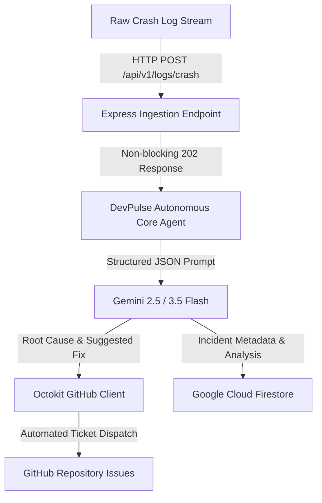

# 🤖 DevPulse Agent

> **Autonomous Backend Reliability & Log Triage Agent**  
> *Built for the Google Cloud: All Things Agentic Hackathon (Taskmaster Category)*

DevPulse Agent is an autonomous background reliability engine that intercepts raw server crash logs, diagnoses root causes using **Gemini**, generates actionable code fixes, and automatically dispatches structured tickets to **GitHub Issues** while persisting incident metadata to **Google Cloud Firestore**.

---

## 🎯 The Problem & Operational Friction (BYOF)

During modern backend development, handling runtime crashes requires manual labor:
1. Context-switching away from active development to SSH into live servers or search cloud log streams.
2. Manually parsing noisy stack traces to locate line failures.
3. Drafting issues on tracking platforms and searching for patch solutions.

**DevPulse eliminates this friction entirely.** It sits silently behind your backend services, accepts standard error logs asynchronously, and handles the end-to-end triage loop without human intervention.

---

## 🏗️ System Architecture



### Architectural Highlights
* **Non-Blocking Execution:** Accepts payloads immediately with a `202 Accepted` response, executing Gemini analysis asynchronously to prevent caller timeouts.
* **Structured Output Enforcement:** Uses strict `@google/genai` JSON schema definitions (`responseSchema`) to enforce zero-hallucination, auto-parsable diagnostic objects.
* **Dual Persistence State:** Maintains real-time tracking links in Firestore alongside actionable issue records in GitHub.

---

## 🛠️ Tech Stack & Dependencies

* **Runtime:** Node.js (ES Modules)
* **Web Framework:** Express.js
* **AI Engine:** Google GenAI SDK (`@google/genai`) using `gemini-2.5-flash` / `gemini-3.5-flash-lite`
* **Database:** Google Cloud Firestore (`firebase-admin`)
* **Integrations:** GitHub REST API (`@octokit/rest`)

---

## 🚀 Quick Start & Local Setup

### 1. Prerequisites
* Node.js v18+ installed
* A Google Cloud / Firebase account with Firestore enabled
* A GitHub Personal Access Token (PAT) with `repo` issue write permissions

### 2. Installation
```bash
# Clone the repository
git clone [https://github.com/Abdullahkamanger/DevPulse-agent.git](https://github.com/Abdullahkamanger/DevPulse-agent.git)
cd DevPulse-agent

# Install dependencies
npm install
```

### 3. Environment Configuration
Create a `.env` file in the root folder using the structure below:

```env
PORT=3000
GEMINI_API_KEY=your_google_ai_studio_key
GEMINI_MODEL=gemini-2.5-flash
GITHUB_TOKEN=your_github_personal_access_token
GITHUB_OWNER=Abdullahkamanger
GITHUB_REPO=DevPulse_testing_repo
FIREBASE_SERVICE_ACCOUNT_KEY='{"type":"service_account","project_id":"..."}'
```

### 4. Running the Server
```bash
# Start local server
node server.js
```

---

## 🧪 Testing the Autonomous Workflow

Send a mock stack trace payload to the local endpoint:

```bash
curl -X POST http://localhost:3000/api/v1/logs/crash \
  -H "Content-Type: application/json" \
  -d '{
    "service_name": "auth-service",
    "environment": "staging",
    "raw_log": "TypeError: Cannot read properties of undefined (reading '\''id'\'')\n    at getUserProfile (/app/dist/controllers/userController.js:84:22)"
  }'
```

Query stored incident histories:
```bash
curl http://localhost:3000/api/v1/incidents
```

---

## 🔮 Roadmap & Future Improvements

- [ ] **Google Cloud Pub/Sub Queue:** Upgrade in-memory background promises to durable Cloud Pub/Sub message queues.
- [ ] **Automated Pull Requests:** Extend the agent from opening GitHub Issues to opening automated fix Pull Requests (PRs).
- [ ] **Log PII Scrubbing:** Add regex scrubbing layers to sanitize secret credentials before passing traces to LLMs.